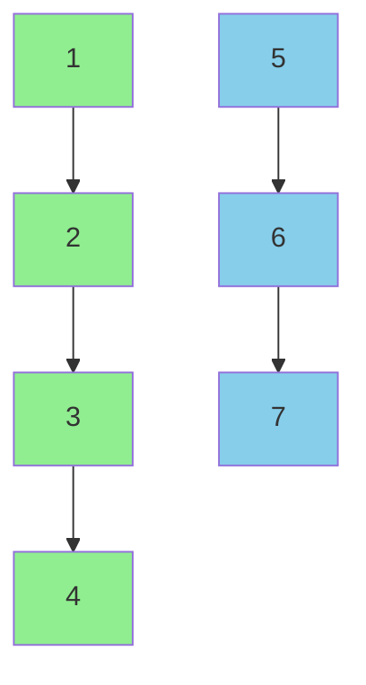
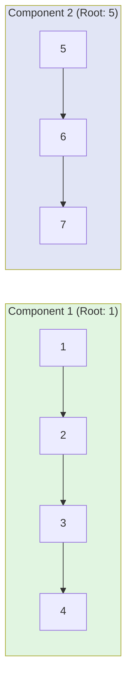

# Disjoint Union Set (DSU) - Bhai Samajh lo!

## Kyun Use Karein? 🤔
Jab questions mein **connected components** poochein, seedha DSU se solve hoga! 

## Kaise Karte Hain DSU?

### 1. Parent Array Maintain Karo
Har node ke liye parent array rakhna pdta hai jisse pata chal jaaye kaunsa node kis component se connected hai.

```java
int pu = find(u, parent);      // u ka root nikaal
int pv = find(v, parent);      // v ka root nikaal

parent[pv] = pu;  // ya phir parent[pu] = pv
```

### 2. Find Operation - Root Nikalne Ka Code
```java
public int find(int node, int[] parent){
    while(node != parent[node]){
        node = parent[node];   // parent ko dekh dekh ke chal
    }
    return node;               // final root milgaya
}
```

## Ye Kaise Kaam Karta Hai?

DSU ka main concept: connected nodes ko ek hi root node se assign kar dete ho.



**Samajhlo:** Jitne alag-alag root node hain, utne hi number of **connected components** hain! 🎯

## Real Example: Pehla Optimized Nahi, Phir Optimized

Maan le do non-connected components hain:
```
1-2-3-4   5-6-7
```



Isme dekho - 2 different roots (1 aur 5) = 2 components! 

## Optimization: Union by Rank Karo - Smart Way!

Upar wali basic approach kaam to kar jaati hai, par optimize nahi hai. Isse pehle check kar le ki kaunsa tree chota/bada hai, phir small ko big ke under attach kar.

```java
public void union(int u, int v, int[] parent, int[] rank) {
    int pu = find(u, parent);      // u ka root nikaal
    int pv = find(v, parent);      // v ka root nikaal
    
    if (pu == pv) return;          // already ek hi component mein hain
    
    // Smaller tree ko big tree ke under attach kar
    if (rank[pu] < rank[pv]) {
        parent[pu] = pv;           // pu ko pv ke under kar
    } else if (rank[pu] > rank[pv]) {
        parent[pv] = pu;           // pv ko pu ke under kar
    } else {
        parent[pv] = pu;           // same rank ho to koi bhi kar
        rank[pu]++;                // aur rank badha
    }
}
```

**Kya faayda?** Isse tree ka height kam rehta hai, aur find operation jaldi hota hai! ⚡

## Extra Optimization: Path Compression - Ultimate Power! 💪

Find operation karte time hi tree ko flat kar do!

```java
public int find(int node, int[] parent) {
    if (node != parent[node]) {
        parent[node] = find(parent[node], parent);  // Direct link kar do root se!
    }
    return parent[node];
}
```

**Matlab:** Jab root dhundne jaate ho, raaste mein sabko directly root se connect kar do! Agle baar jab koi pooch le to seedha milgaya! 🚀

---

## Grid union formula
1. i*col+j - For converting a cell into a array index

## Summary - Ek Nazar Mein:

1. **Basic DSU** - Parent array + find operation
2. **Union by Rank** - Smart unions to keep tree balanced  
3. **Path Compression** - Find operation fast karo

**Teen cheezein mil jayen to:**
- Connected components question ka answer mil jaega!
- Performance bhi amazing hogi!
- Code bhi clean rhe gi!

Bas yaar, yeh samajh gaya to poore DSU questions solve kar lega! 🔥
